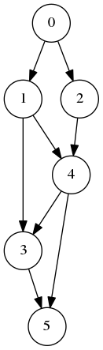
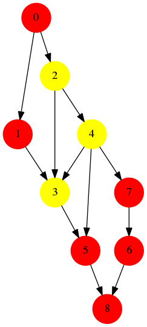

## Step1 Graph Overview
- create a graph, initialize with number of nodes
- add edges
- print the graph 

> python3 step1_graph_overview.py

you should get:
```
node 0: 1 2
node 1: 3 4
node 2: 4
node 3: 5
node 4: 3 5
node 5:
```
which is the **adjacency list** representation of graph.

## Step2 Graph Visualization
Firstly, install 
> sudo pip3 install pydot
> 
> sudo apt-get install graphviz

The implementation is by adding a function `to_png`

> python3 step2_graph_visualization.py

you should get the saved "graph.png":




## Step3 Breadth_First_Search
The basic idea of BFS is to firstly add all sub_nodes in one level, then, go deeper.

Here we have 2 BFS implementations:
* using recursive function, with inititial nodes
* using while and a queue


> python3 step3_graph_BFS.py

you should get
```
BFS:  [0, 1, 2, 3, 4, 5]
BFS1:  [0, 1, 2, 3, 4, 5]
```
## Step4 Depth_First_Search
The basic idea of DFS is to firstly add deep sub, then go back to other child

Here we implement DFS using recursive function:

> python3 step4_graph_DFS.py

you should get
```
DFS:  [0, 1, 3, 5, 4, 2]
```

## Step5: Topological Sort 
Here we have 2 implementataions:
- recursive function
- by definition (indegree)

> python3 step5_graph_tolologic_sort.py
 
you should get
```
sort:  [0, 2, 1, 4, 3, 5]
sort1:  [0, 1, 2, 4, 3, 5]
```

## Step6: Graph All Paths
get all paths form `node_src` to `node_dst`:
> python3 step6_graph_all_path.py
 
you should get
```
all path from 0-5:
 [[0, 1, 3, 5], [0, 1, 4, 3, 5], [0, 1, 4, 5], [0, 2, 4, 3, 5], [0, 2, 4, 5]]
```

## Step7: Graph with color
graph with node attributes(color)
## Step8: Graph with config file
`graph2.cfg`
```
N
0 0
1 0
2 1
3 0
4 1
5 0

E
0 1
0 2
1 3
2 4
1 4
4 3
3 5
4 5
```
## Step9: Sub graph with optimize sort


```
optimize =  0
sort list: [0, 2, 1, 4, 3, 7, 5, 6, 8]
[[0], [2], [1], [4, 3], [7, 5, 6, 8]]

optimize =  1
sort list: [0, 1, 2, 4, 3, 7, 5, 6, 8]
[[0, 1], [2, 4, 3], [7, 5, 6, 8]]
```
## Reference
1. [Graph and its representations](https://www.geeksforgeeks.org/graph-and-its-representations/)
2. [Breadth First Traversal for a Graph](https://www.geeksforgeeks.org/breadth-first-search-or-bfs-for-a-graph/)
3. [Depth First Traversal for a Graph](https://www.geeksforgeeks.org/depth-first-search-or-bfs-for-a-graph/)


